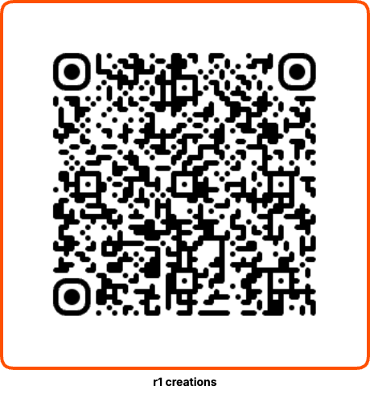

# R1 Radio

Web Radio Card for Rabbit R1.



## Run

```bash
npm install
npm run dev
```

## Build

```bash
npm run build
```

Build output goes to `docs/`.

## Controls

- `sideClick` or `Space`: play / stop / resume
- `scrollUp` or `ArrowUp`: volume up
- `scrollDown` or `ArrowDown`: volume down
- Mouse wheel: volume fallback in browser
